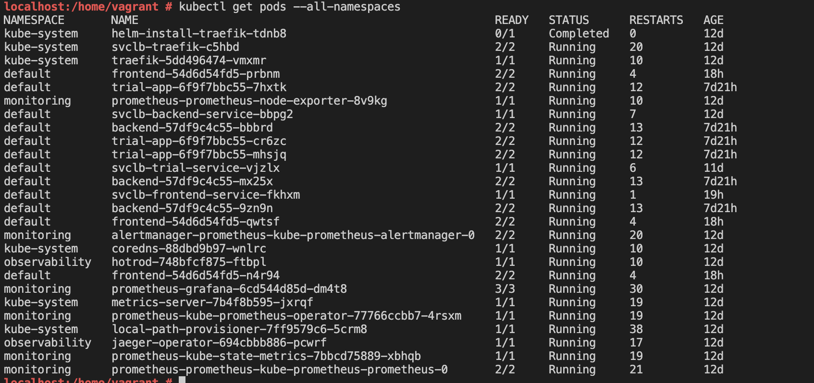

**Note:** For the screenshots, you can store all of your answer images in the `answer-img` directory.

## Verify the monitoring installation

## Setup the Jaeger and Prometheus source

## Create a Basic Dashboard

## Describe SLO/SLI
SLOs:
1. The app will have an uptime of 95% in a given month
2. 90% of all requests will take less than 200ms in a given month

SLIs:
1. The rate of http HTTP requests which are with status code 4XX or 5XX
2. The percentage rate of the successful requests which are under 200ms latency

## Creating SLI metrics.
1. Uptime for FrontEnd: Number of successful HTTP requests per month / total HTTP requests per month for Frontend app in the last 24 hours
2. Uptime for Backend: Number of successful HTTP requests per month / total HTTP requests per month for Backend app in the last 24 hours
3. Backend requests reponse time: Backend app api requests duration seconds in the last 24 hours 
4. Frontend requests reponse time: Frontend app api requests duration seconds in the last 24 hours 
5. Errors per second: Number of http requests with 4XX and 5XX status for both Frontend and Backend app

## Create a Dashboard to measure our SLIs

## Tracing our Flask App

## Jaeger in Dashboards

## Report Error
Using the template below, write a trouble ticket for the developers, to explain the errors that you are seeing (400, 500, latency) and to let them know the file that is causing the issue also include a screenshot of the tracer span to demonstrate how we can user a tracer to locate errors easily.

TROUBLE TICKET

Name: Json decode error occured in get-python-jobs of trial app

Date: 2022 Jan 01

Subject: Json decode error occured in get-python-jobs of trial app

Affected Area: Trial App

Severity: High

Description: When make a call to trace  api of trial app, curl http://10.0.2.15:8082/trace,  one Json Decode Error happens and please see below screenshot for details.

Screenshot: 

## Creating SLIs and SLOs
We want to create an SLO guaranteeing that our application has a 99.95% uptime per month. Name four SLIs that you would use to measure the success of this SLO.

1. Latency
   SLI: API response time in seconds in last 30 days
   SLO: 9.95% uptime of last 30 days
2. Traffic
   SLI: Number of requests per seconds for last 30 days
   SLO: 10 TPS (Transactions per seconds)
3. Errors:
   SLI: The number of requests that are failing for last 30 days
   SLO: Error budget is defined at 0.05% for last 30 days
4. Saturation
   SLI: The system resource utilization for last 30 days
   SLO: The CPU usage and memory usage should be less than 80% for last 30 days

## Building KPIs for our plan
Now that we have our SLIs and SLOs, create a list of 2-3 KPIs to accurately measure these metrics as well as a description of why those KPIs were chosen. We will make a dashboard for this, but first write them down here.
1.KPI of latency:
  1) The time it takes for the app to response for the request, it should me measured in milliseconds. With milliseconds, user could visualize and interpate the graph more easily.
  2) It's important to distinguish the latency of successful requests and latency of failed requests. Because the logic for processing failed requests are at different app layer, oso it's better to process them seperatelly.
  3.It's good to track failed requests latency. In some cases, the error handing probably will make the app to response the error with longer time and we need to monitor that.
2. KPI for traffic:
  1) The numer of requests which were processed by app, it's often measured by requests per second
  2) It's important to include both failed requests and successful requests to measure. That's because even the failed requests also consumed the app's resource to process.
3. Errors
  1)We need to define number of requests with http status code 4XX or 5XX. For 4XX code, it means the app encountered some authentication or authorization issue and 5XX means some server side error happened.
  2)It's good to seperate the 4XX error and 5XX error to make the user to understand the error category in a more straightforward way.
4. Saturation
  1) It's important to include the memory usage as it's a good indicator for the system capability to process the requests.
  2) It's important to include the CPU usage as it indicates the system's computation capability.

## Final Dashboard

