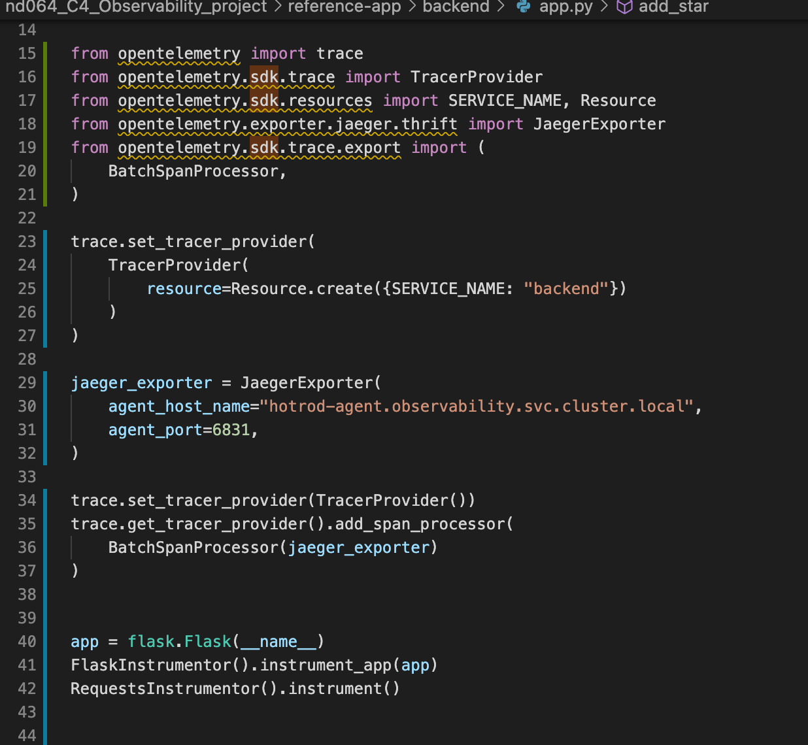

**Note:** For the screenshots, you can store all of your answer images in the `answer-img` directory.

## Verify the monitoring installation

## Setup the Jaeger and Prometheus source

## Create a Basic Dashboard

## Describe SLO/SLI
SLO is a goal to set by the team in order to evaluate the performance of the application.
SLI is a specified metrics or indicator in the past time for the measurement of the application.

## Creating SLI metrics.
1. Max Latency of all requests
2. App uptime
3. Throughput
4. Error rate
5. Average Response time

## Create a Dashboard to measure our SLIs

## Tracing our Flask App

## Jaeger in Dashboards

## Report Error
Using the template below, write a trouble ticket for the developers, to explain the errors that you are seeing (400, 500, latency) and to let them know the file that is causing the issue also include a screenshot of the tracer span to demonstrate how we can user a tracer to locate errors easily.

TROUBLE TICKET

Name: Json decode error occured in get-python-jobs of trial app

Date: 2022 Jan 01

Subject: Json decode error occured in get-python-jobs of trial app

Affected Area: Trial App

Severity: High

Description: When make a call to trace  api of trial app, curl http://10.0.2.15:8082/trace,  one Json Decode Error happens and please see below screenshot for details.

Screenshot: 

## Creating SLIs and SLOs
We want to create an SLO guaranteeing that our application has a 99.95% uptime per month. Name four SLIs that you would use to measure the success of this SLO.
1. Errors per seconds
2. Requests per seconds
3. Requests  duration
4. Average response time

## Building KPIs for our plan
Now that we have our SLIs and SLOs, create a list of 2-3 KPIs to accurately measure these metrics as well as a description of why those KPIs were chosen. We will make a dashboard for this, but first write them down here.
1. We need to measure errors per seconds to view how many request errors are there based on the timeline
2. We need to measure how is  the requests rate per seconds so that we can compare with the error per seconds graph to view it
3. We need to see the requests duration includes the min request latency and max request latency as the uptime means the request should not exceed certain threshold
4. We need to see avg response time to understand more on the application performance 

## Final Dashboard

